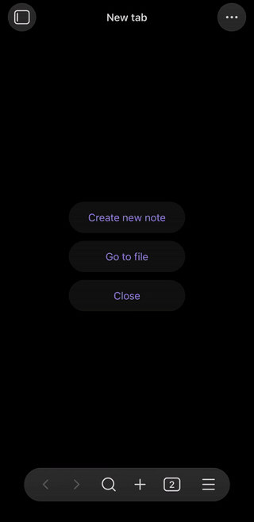
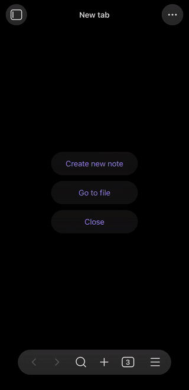
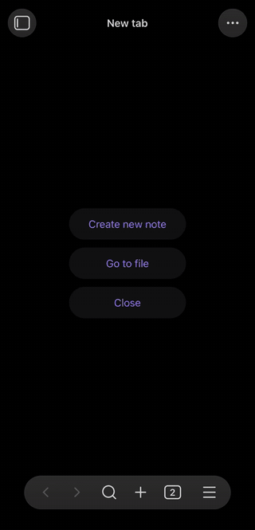
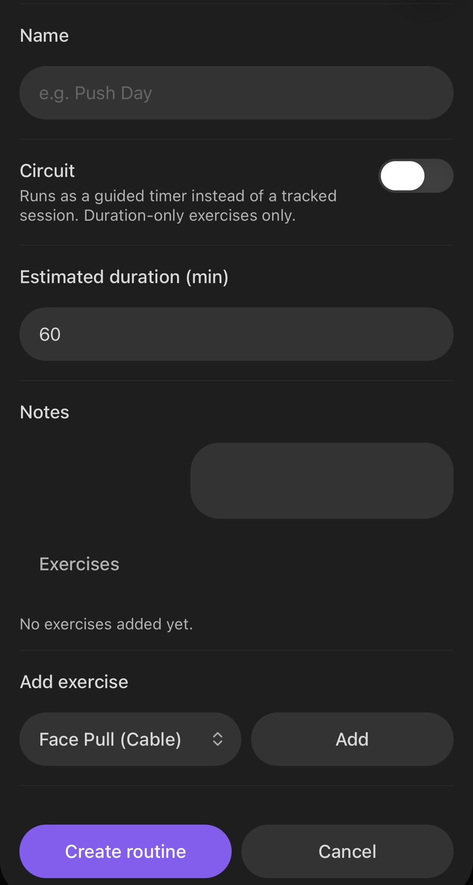
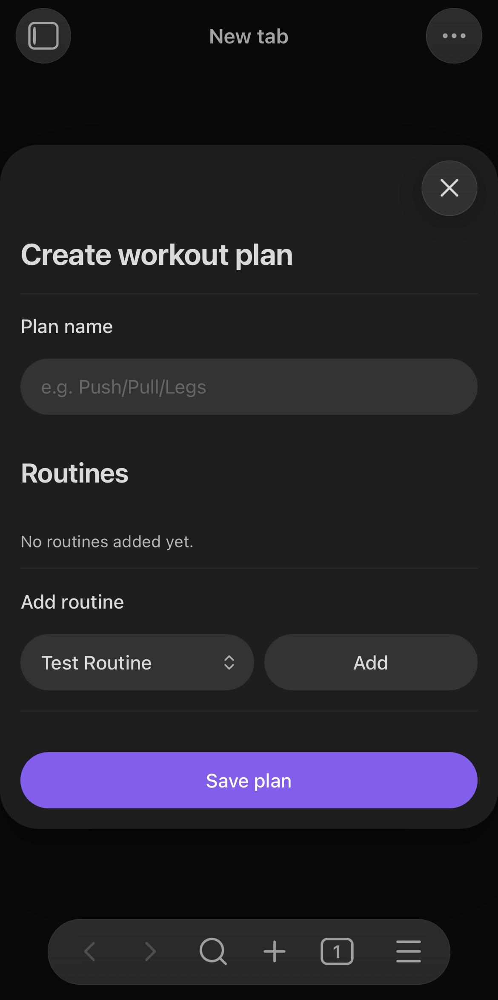
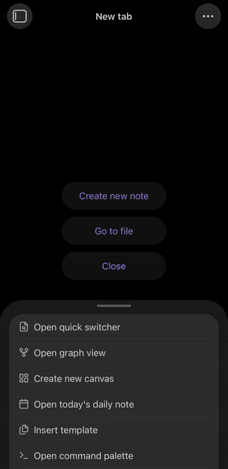
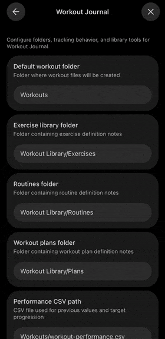

# Workout Journal

<p align="center">
  
</p>

A completely free workout tracking solution for Obsidian that stays integrated
with your vault while providing a **full fitness-app like interface**. You get
an active session view, edit windows for the different note types (exercises,
routines, and workout plans), and an **app-like dashboard** to manage it all
from. Still every element of it lives in your vault. Every part is represented
in a markdown note, and thus can be integrated into your personal knowledge
management system. **Everything is in plain text: You own your data.**

A big issue with fitness tracking is usually the first setup: setting up your
exercise library, migrating your routines and history. This is why this plugin
comes with an **exercise catalog of 1,324 exercises with instructions**. Don't worry
only exercises you actually use will show up in your Vault, so no needless clutter! The second issue is solved for those coming from Strong, simply export your history from there and get it into your vault with the **"Import from Strong" feature** in settings. You can automatically get all exercises you have used in a completed workout and from these completed workouts you can also extract the full routine with the provided command.

(I know many people use Hevy now, hope I can add this soon. I heard the export is pretty similar too Strong.)

## Team Plain-Text

- **Your data stays yours:** One markdown note per workout, exercise, routine,
and plan, plus a flat CSV of every set you have ever done. Nothing is locked in
a proprietary database.
- **It talks to the rest of your vault:** Exercises, routines and plans are all
notes, so they link, they show up in graph view, and Dataview can query them.
- **It still feels like an app when it matters:** During a session you are not
editing YAML — you are tapping through sets with a rest timer running.

A side note: Because everything is just markdown, you can have self-written
scripts and even your agent of choice create and edit your Routines and Plans
for you. Full automation without paying for an additional subscription!

## Active Session View

The active session view is mainly built for mobile. It has all the features you
would want (I hope, if not feel free to open a feature request ;D):

- Automatic fill of last performed stats.
- Automatic rest timer
- Session timer
- Show exercise notes, history and description
- Add routine specific notes to exercises
- Add a note to the workout
- Add new sets, exercises, switch them out or re-order via drag and drop
- Change set type to Warmup, Myoreps or Drop Set
- On finish you can overwrite with the changes you made or ignore and
automatically finish unfinished sets

If you come from a fitness app this should look and feel familiar:
<p align="center">
  
</p>

## Dashboard

Pretty much what you expect:

- Start an empty workout, or start a routine from your library
- Reenter an unfinished workout
- Routines organized in Plans that act as folders
- Add new Plans and routines, or edit existing ones
- Browse your exercise library — search it, pull new exercises in from the
  catalog, or create your own, and tap one to open its note
- Page back through every workout you have logged, and tap one to open its note
- See your workout statistics

<p align="center">
  
</p>

## Exercises

Built your Exercise Library quickly from the catalog of 1,324 exercises or get
them from the Strong import. If both can't get you what you need, you can create
your own in the exercise editor. You can also merge the description from the
catalog into exercises you have created. There are many different types:
strength (kg,reps), cardio (min,km), reps-only (reps), duration-only (s).

<p align="center">
  
</p>

## Routines and Plans

Both feature an editor, that can be accessed from the command palette or
directly from a dashboard. Routines organize a collection of exercises with
sets, and exercise-specific notes into a workout. Plans organize a collection of
routines into a multi-day schedule (settings specific days of the week is optional). Due to the inherent nature of everything being a note that can just be referenced, routines can be assigned to multiple plans without duplicating them.

Plan notes can be used to jot down notes about the your fitness plan related to
it. Those notes wont show up in the interfaces the plugin provides.

<table>
  <tr>
    <td align="center" width="50%">
      
      <br><sub><b>An active session</b> — sets, rest timer, notes</sub>
    </td>
    <td align="center" width="50%">
      
      <br><sub><b>A circuit</b> — guided work and pause windows</sub>
    </td>
  </tr>
</table>

## Circuit Training

For those who like to do circuit training, simply change the type of the routine
in the interface, or alternatively set the boolean property in the YAML
frontmatter of the routine note. If you start it in an active session it will
automatically enter it in circuit mode. All of the exercises in the routine must be
duration-only for that.

This is what you are greeted with:
<p align="center">
  
</p>

## Configuration

Settings → Community plugins → Workout Journal:

- **Folders** for workouts, exercises, routines and plans
- **Units** — kg or lb, km or mi
- **Rest timer** default, plus sound and vibration feedback
- **Exercise images** — link to them, or turn them off entirely
- **Note templates** — extra frontmatter and body content merged into everything
  the plugin creates, so it fits your existing vault conventions
- **Library management** for exercises, routines and plans

<p align="center">
  
</p>

## Installation

You can simply get it from the Obsidian community plugins browser, or install it
manually:

### With BRAT (recommended for beta testing)

1. Install the [BRAT plugin](https://github.com/TfTHacker/obsidian42-brat)
2. Open BRAT settings and click **Add beta plugin**
3. Enter `https://github.com/I-am-Rudi/obsidian-workout-journal.git`
4. Choose a version (`latest`, or a specific release tag)
5. Click **Add plugin**, then enable **Workout Journal** under community plugins

### Manual installation (development)

1. Clone this repository
2. `npm install`
3. `npm run build`
4. Copy `main.js`, `manifest.json` and `styles.css` into
   `<your vault>/.obsidian/plugins/workout-journal/`
5. Enable the plugin in Obsidian settings

### Getting started

The fastest path from a fresh install to your first logged set:

1. Open settings and point the plugin at the folders you want it to use
2. Open the **exercise catalog** and import a handful of exercises you actually
   train — or skip this and add them as you go
3. Tap the ribbon icon
4. Press "+" to build a **routine** from those exercises
5. Press "start" to start the routine in an active session

### Interfaces

- **Ribbon icon** — the landing page: resume a session, start an empty workout,
  or pick any routine, grouped under the plan it belongs to
- **Command palette** — everything the plugin can do, including starting a
  session from the note you have open
- **Settings** — manage your library, routines and plans, configure folders and
  units, and run imports

## How an exercise note is laid out

Everything the catalog adds goes under a `## Description` heading. Everything
under `## Notes` is yours — the plugin writes there only when you edit it
yourself, and never overwrites it.

```markdown
---
wj-type: exercise
wj-id: ds-0025
wj-name: Barbell Bench Press
wj-muscle-groups: [pectorals, triceps, deltoids]
wj-exercise-type: strength
wj-equipment: barbell
wj-source: exercises-dataset
wj-source-id: "0025"
---
# Barbell Bench Press

## Description


Lie flat on a bench with your feet planted…

*© Gym visual — https://gymvisual.com/*

## Notes

Left shoulder twinges above 80 kg. Elbows tucked 45°.
```

During a session, tapping an exercise name opens that note in three tabs —
**Note**, **History** and **Description** — so you can check your form cues, see
what you lifted last month, and scribble something down without leaving the
workout. Your notes also show up as a blue ribbon in session view.

### Pictures and network use

> [!note]
> The exercise **descriptions** are bundled with the plugin and work completely
> offline. The **pictures** are not: the note contains a link, and Obsidian loads
> it from a CDN when you look at it.

This is deliberate. The picture files are © Gym visual and are not covered by the
dataset's MIT licence, so the plugin links to them where they are already
published rather than copying them into your vault. If you would rather not load
anything from the network, set **Exercise images** to **No image** in settings and
the plugin will only ever write text.

## How your data is stored

Every note the plugin manages uses `wj-`-prefixed YAML frontmatter, with
`wj-type` marking what it is: `exercise`, `routine`, `plan` or `workout`.

```markdown
---
wj-type: workout
wj-id: "1672531200000"
wj-date: "2025-06-26"
wj-name: "Morning Run"
wj-duration: 30
wj-exercises:
  - name: "Running"
    sets:
      - duration: 30
        distance: 3
wj-notes: "Beautiful morning for a run"
---

# Morning Run

**Date:** 2025-06-26
**Duration:** 30 minutes

## Exercises

### Running

| Set | Reps | Weight | Duration | Distance | Rest |
| --- | ---- | ------ | -------- | -------- | ---- |
| 1   | -    | -      | 30       | 3        | -    |

## Notes

Beautiful morning for a run
```

Alongside the notes, every completed set is appended to a flat performance CSV.
That is what drives the previous-values pre-fill, and it means you can pull your
whole training history into a spreadsheet whenever you want.

## Credits and licence

The plugin is MIT licensed — see [LICENSE](./LICENSE).

The exercise catalog comes from
[hasaneyldrm/exercises-dataset](https://github.com/hasaneyldrm/exercises-dataset).
The data is MIT licensed; the exercise images are © Gym visual and are used by
linking only. See [NOTICE.md](./NOTICE.md) for the full attribution.

Originally forked from
[obsidian-workout-tracker](https://github.com/wanabeunique/obsidian-workout-tracker).
